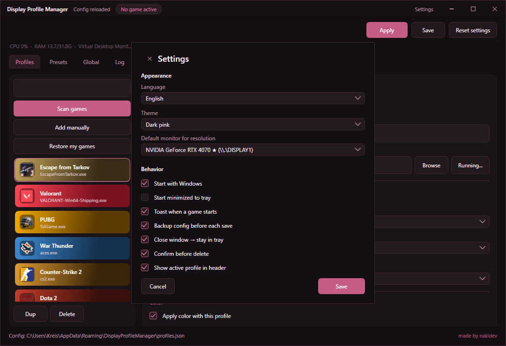

<p align="center">
  
</p>

<h1 align="center">Display Profile Manager</h1>

<p align="center">
  <strong>Per-game display profiles for Windows</strong><br>
  Automatically switch resolution, power plan, and color when a game starts — and restore everything when it exits.
</p>

<p align="center">
  <a href="https://github.com/Naki-404/DisplayProfileManager/releases/latest"></a>
  <a href="https://github.com/Naki-404/DisplayProfileManager/releases/latest"></a>
  
  
</p>

<p align="center">
  <a href="#download">Download</a> ·
  <a href="#features">Features</a> ·
  <a href="#how-it-works">How it works</a> ·
  <a href="#build-from-source">Build</a>
</p>

---

## Preview

<p align="center">
  
</p>

<p align="center"><em>Profiles — pick a game, tune resolution / power / color, then Save.</em></p>

<p align="center">
  
</p>

<p align="center"><em>Settings — language, theme, monitor, tray and startup options.</em></p>

---

## Download

| File | What it is |
|------|------------|
| **[DisplayProfileManager-Setup.exe](https://github.com/Naki-404/DisplayProfileManager/releases/latest)** | Recommended installer (Start Menu + Apps and Features uninstall) |
| **DisplayProfileManager.exe** + **QRes.exe** | Portable — unpack and run |

**Requirement:** [.NET Desktop Runtime 6+](https://aka.ms/dotnet/6.0/windowsdesktop-runtime-win-x64.exe) (x64).  
The installer detects a missing runtime and opens the download page for you.

Default install location:

```text
%LocalAppData%\Programs\DisplayProfileManager\
```

Config (profiles, preferences):

```text
%AppData%\DisplayProfileManager\profiles.json
```

---

## Features

- **Per-game profiles** — resolution, Windows power plan, brightness / contrast / gamma
- **Auto apply** — watches for the game process, applies the profile, restores defaults on exit
- **Game scanner** — find installed / running games, or add an `.exe` manually
- **Companions** — launch helper apps with the game (and stop them afterward)
- **Hotkey presets** — per-game color tweaks while the game is running
- **Tray mode** — close to tray, quick presets from the tray menu
- **Themes** — dark, light, or a fully custom color palette
- **EN / RU** — language switch in Settings or the first-run wizard
- **Import / export** — share or back up your `profiles.json`
- **Compact** — single-file build (~3 MB setup), no loose asset folders

> Display changes use the Windows API (`ChangeDisplaySettingsEx`).  
> `QRes.exe` is only a tiny fallback if the API call fails.

---

## How it works

```text
  Game starts  -->  match .exe to a profile  -->  apply resolution / power / color
                                                        |
  Game exits   <----------------------------------------+
               restore your previous / global defaults
```

1. **Scan** or add games you care about.
2. For each profile: enable it, set resolution / power plan / color.
3. Leave the app running in the tray (optional autostart).
4. Launch the game as usual — the profile applies automatically.

Nothing is injected into games. The app only changes **PC display and power settings**.

---

## First launch

A short wizard asks for:

- Language (English / Russian)
- Theme (dark / light / custom)
- Autostart, tray, toast notifications
- Default monitor

You can change all of this later via **Settings** in the title bar.

---

## Build from source

```powershell
git clone https://github.com/Naki-404/DisplayProfileManager.git
cd DisplayProfileManager
dotnet build .\DisplayProfileManager.csproj -c Release
```

Create the installer + portable package:

```powershell
powershell -ExecutionPolicy Bypass -File .\build-release.ps1
```

Output:

```text
dist\DisplayProfileManager-Setup.exe
dist\portable\DisplayProfileManager.exe
dist\portable\QRes.exe
```

Requires the .NET 6 SDK (or newer) with Windows Desktop workload.

---

## Project layout

```text
DisplayProfileManager/
├── Assets/                 # Embedded images and icon
├── Services/               # Display engine, watcher, config, themes
├── Installer/              # Compact Windows setup project
├── docs/screenshots/       # README images
├── build-release.ps1       # One-shot publish script
└── DisplayProfileManager.csproj
```

---

## Privacy and safety

- Config stays on your PC under `%AppData%`
- No telemetry, no accounts, no cloud sync
- Safe for anti-cheat: system settings only — no game memory / input hooks

---

## Author

**nakidev** · [Naki-404](https://github.com/Naki-404)

---

## License

Personal / freeware use. See repository for terms if added later.
