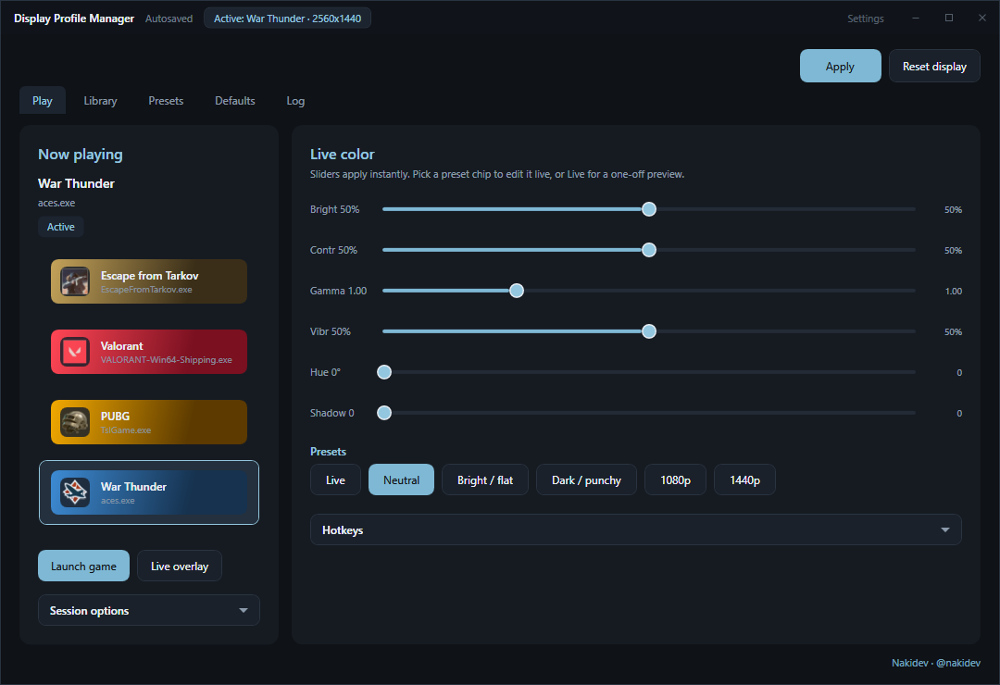
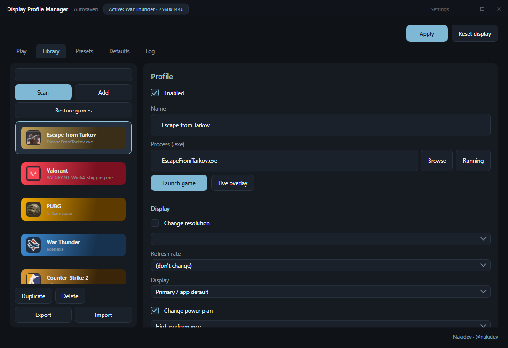
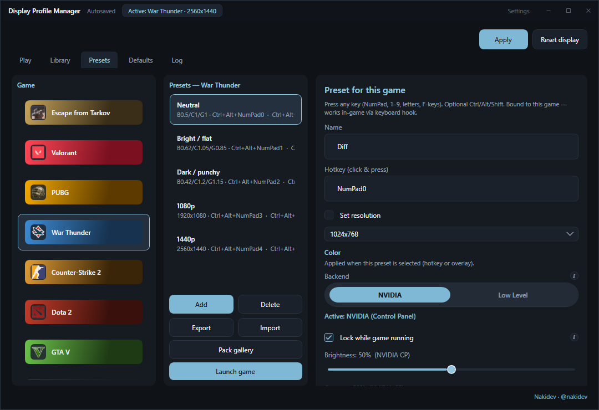

<p align="center">
  
</p>

<h1 align="center">Display Profile Manager</h1>

<p align="center">
  <strong>Per-game display profiles for Windows</strong><br>
  Switch resolution, power plan, and color when a game starts — restore everything when it exits.<br>
  No injection. System settings only.
</p>

<p align="center">
  <a href="https://github.com/Naki-404/DisplayProfileManager/releases/latest"></a>
  <a href="https://github.com/Naki-404/DisplayProfileManager/releases/latest"></a>
  
  
  
  
</p>

<p align="center">
  <a href="#download">Download</a> ·
  <a href="#screenshots">Screenshots</a> ·
  <a href="#features">Features</a> ·
  <a href="#how-it-works">How it works</a> ·
  <a href="#build-from-source">Build</a>
</p>

---

## Screenshots

<p align="center">
  <br>
  <em>Play — live color, presets, and session options while a game is active</em>
</p>

<p align="center">
  <br>
  <em>Library — enable profiles, resolution, power plan, companions</em>
</p>

<p align="center">
  <br>
  <em>Presets — hotkeyed color profiles per game + pack gallery</em>
</p>

---

## Download

| File | What it is |
|------|------------|
| **[DisplayProfileManager-Setup.exe](https://github.com/Naki-404/DisplayProfileManager/releases/latest)** | Recommended installer (Start Menu + Apps & Features uninstall) |
| **[DisplayProfileManager.exe](https://github.com/Naki-404/DisplayProfileManager/releases/latest)** | Portable single-file build |

**Requirement:** [.NET Desktop Runtime 6+ (x64)](https://aka.ms/dotnet/6.0/windowsdesktop-runtime-win-x64.exe)  
The installer detects a missing runtime and opens the download page.

| Path | Purpose |
|------|---------|
| `%LocalAppData%\Programs\DisplayProfileManager\` | Default install folder |
| `%AppData%\DisplayProfileManager\profiles.json` | Profiles & settings |
| `%AppData%\DisplayProfileManager\DisplayProfileManager.log` | App log (`INFO` / `WARN` / `ERROR`) |

---

## Features

- **Play-first UI** — slate dark theme, live brightness / contrast / gamma / vibrance / hue
- **Per-game profiles** — resolution, refresh rate, power plan, session extras
- **Auto apply** — arms when the process starts, restores snapshot / defaults on exit
- **Hotkey presets** — switch looks in-game (keyboard + mouse X1/X2)
- **Pack gallery** — bundled Tarkov / Valorant / PUBG packs
- **Live overlay** — compact on-screen controls without leaving the game
- **Center-screen zoom** — Windows Magnifier API (no game injection)
- **NVIDIA FPS limit** — optional driver FPS cap per profile
- **Companions** — launch helper apps with the game and stop them afterward
- **Tray mode** — close to tray, quick profile / preset switch
- **Themes** — dark / light / custom · **EN / RU**
- **Emergency restore** — one-click safe display reset

> Uses Windows display APIs (`ChangeDisplaySettingsEx` and related). Optional `QRes.exe` is only a fallback.  
> Nothing is injected into games — safe for anti-cheat as far as memory/input hooks go.

---

## How it works

```text
  Game starts  -->  match .exe to a profile  -->  apply resolution / power / color
                                                        |
  Game exits   <----------------------------------------+
               restore previous snapshot / global defaults
```

1. Scan or add games in **Library**.
2. Tune color in **Play** or hotkey presets in **Presets**.
3. Leave the app in the tray (optional autostart).
4. Launch the game as usual — the profile applies automatically.

---

## Build from source

```powershell
git clone https://github.com/Naki-404/DisplayProfileManager.git
cd DisplayProfileManager
dotnet build .\DisplayProfileManager.csproj -c Release
```

Create installer + portable package (writes to project-root `\release`):

```powershell
powershell -ExecutionPolicy Bypass -File .\build-release.ps1
```

```text
release\DisplayProfileManager.exe
release\DisplayProfileManager-Setup.exe
release\portable\
```

Requires the .NET 6+ SDK with the Windows Desktop workload.

**Note:** Unsigned builds may trip SmartScreen / antivirus heuristics (process watchers, gamma APIs). A paid Authenticode certificate is the durable fix.

---

## Sync local clone

```powershell
cd C:\Users\Kreis\DisplayProfileManager
git pull origin main
```

Publish local commits:

```powershell
git push -u origin HEAD
```

---

## Project layout

```text
DisplayProfileManager/
├── Assets/                 # app.ico, Sounds, Packs
├── docs/screenshots/       # README images
├── Models/
├── Views/
├── Controls/
├── Services/
│   ├── Display/
│   ├── Session/
│   ├── Config/
│   ├── Input/
│   ├── Ui/
│   └── System/
├── Installer/
├── release/                # build-release.ps1 output (gitignored)
├── build-release.ps1
└── DisplayProfileManager.csproj
```

---

## Privacy

- Config stays on your PC under `%AppData%`
- No telemetry, no accounts, no cloud sync

---

## Author

**Nakidev** · Discord & Telegram [@nakidev](https://t.me/nakidev) · [GitHub](https://github.com/Naki-404)

---

## License

Personal / freeware use. See the repository for terms if added later.
